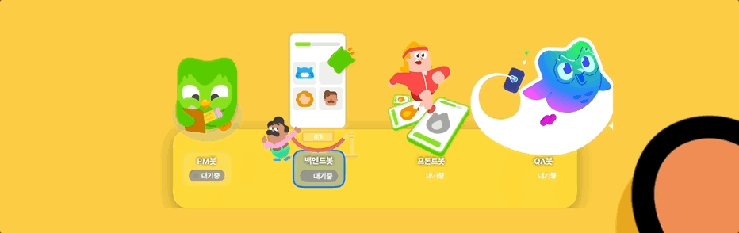
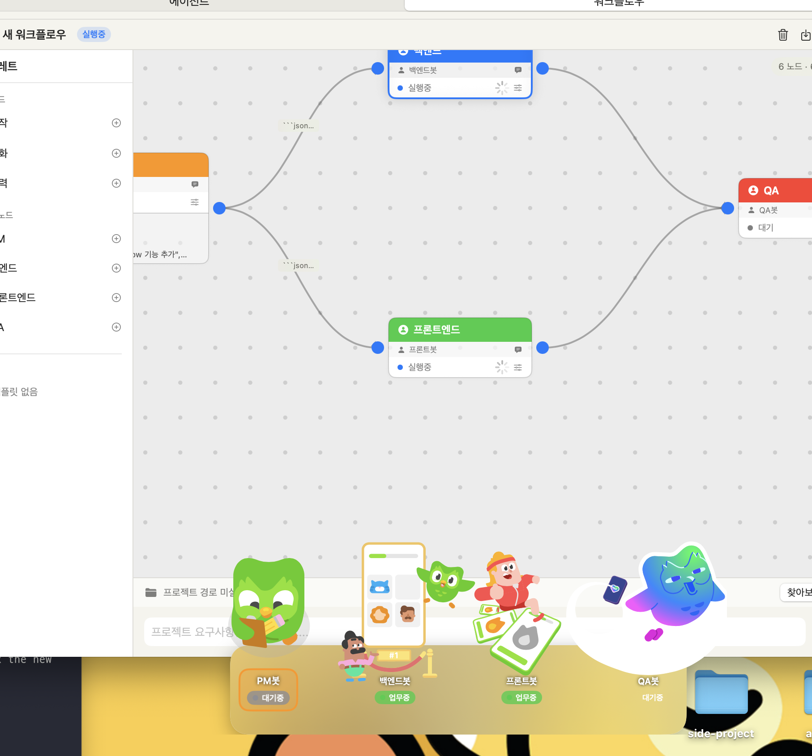

# Chunsik - Multi-Agent Workflow for macOS

Claude 기반의 AI 에이전트들이 팀을 이루어 소프트웨어 개발 작업을 수행하는 macOS 네이티브 앱입니다.

PM, 백엔드, 프론트엔드, QA 역할의 에이전트들이 노드 기반 워크플로우 위에서 순차/병렬로 협업하며, 사용자의 요구사항을 분석하고 코드를 작성합니다.



## 주요 기능

### 노드 기반 워크플로우 에디터

드래그 앤 드롭으로 에이전트 워크플로우를 설계할 수 있습니다. 시작 노드에서 출력 노드까지, 에이전트들의 작업 흐름을 시각적으로 구성합니다.

- 시작 / 에이전트 / 대화 / 출력 4종 노드
- 노드 간 연결로 데이터 흐름 정의
- 병렬 실행 (예: PM → 백엔드 + 프론트엔드 → QA)
- 워크플로우 템플릿 저장 및 불러오기



### AI 에이전트 팀

역할별로 특화된 시스템 프롬프트를 가진 에이전트들이 협업합니다.

| 역할 | 하는 일 |
|------|---------|
| PM | 요구사항 분석, 작업 분해, 기술 명세 작성 |
| 백엔드 | API 설계, 서버 로직, 데이터베이스 구현 |
| 프론트엔드 | UI 컴포넌트, 화면 레이아웃, 사용자 인터랙션 |
| QA | 코드 리뷰, 테스트 작성, 버그 탐지 |

커스텀 에이전트도 만들 수 있습니다. 원하는 역할과 프롬프트를 자유롭게 설정하세요.

### 에이전트 대화 (Conversation Node)

두 에이전트가 서로 대화하며 합의에 도달하는 대화 노드를 지원합니다. 최대 라운드 수와 목표를 설정하면, 에이전트들이 자동으로 토론하고 `[합의완료]` 키워드로 종료합니다.

### 플로팅 캐릭터

바탕화면에 떠 있는 캐릭터들이 에이전트 상태를 실시간으로 보여줍니다. Lottie 애니메이션으로 구현된 캐릭터를 클릭하면 대시보드가 열립니다.

### 노드별 세부 설정

각 노드마다 독립적으로 설정할 수 있습니다:

- 시스템 프롬프트 오버라이드
- AI 모델 선택 (Sonnet / Haiku / Opus)
- Temperature, 최대 토큰 조절
- MCP 도구 연결

설정 우선순위: 노드 커스텀 > 에이전트 설정 > 전역 설정

### 실시간 스트리밍 출력

워크플로우 실행 중 각 노드의 출력을 터미널 스타일로 실시간 확인할 수 있습니다. 도구 사용, 비용, 소요 시간이 함께 표시됩니다.

### 메뉴바 상태 표시

메뉴바에서 연결 상태, 토큰 사용량, 에이전트 상태를 한눈에 확인할 수 있습니다.

## 서비스 백엔드

두 가지 방식으로 Claude를 사용할 수 있습니다:

### Claude Code (CLI)

로컬에 설치된 `claude` CLI를 통해 실행합니다. MCP 도구를 활용한 코드 실행이 가능합니다.

### Claude API

Anthropic API를 직접 호출합니다. API 키만 있으면 별도 설치 없이 사용할 수 있습니다.

## 실행 방법

### 요구 사항

- macOS 14 (Sonoma) 이상
- Swift 5.9 이상

### 빌드 및 실행

```bash
git clone https://github.com/shinseongsu/chunsik.git
cd chunsik

swift build -c release
open .build/release/Chunsik
```

### Claude Code 사용 시

터미널에서 `claude` 명령이 동작해야 합니다. [Claude Code](https://docs.anthropic.com/en/docs/claude-code) 설치 후 사용하세요.

### Claude API 사용 시

앱 설정에서 서비스 백엔드를 "Claude API"로 변경하고, API 키를 입력하세요. 키는 macOS Keychain에 안전하게 저장됩니다.

## 라이선스

MIT License
